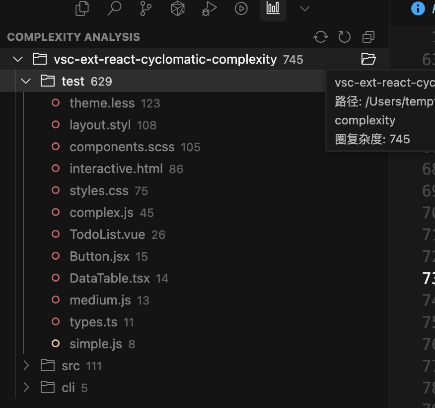

# VSCode 循環的複雑度プラグイン

リソースエクスプローラーでフロントエンドコードファイルの循環的複雑度を直感的に表示するVSCodeプラグインです。JavaScript、TypeScript、Vue、HTML、CSSなど多種のファイルタイプをサポートしています。



## ✨ 主な機能

- **📁 エクスプローラー統合**: ファイルとフォルダの横に循環的複雑度を表示、色分け（緑≤5、黄≤10、赤>10）
- **⚡ 自動分析**: 起動時に全プロジェクトを自動分析
- **📊 専用ビュー**: 独立した循環的複雑度分析パネル、ソートとクイックファイル開きをサポート
- **🚫 スマートフィルタリング**: `.gitignore`を自動読み込み、除外フォルダを設定可能

## 🎮 使用方法

### VSCodeプラグイン

1. **自動起動**: フロントエンドプロジェクトを開いた後、循環的複雑度を自動分析
2. **結果表示**: エクスプローラーでファイル横の複雑度数値を確認
3. **パネル**: 左のアクティビティバーのチャートアイコンをクリックして詳細分析を表示
4. **手動更新**: フォルダを右クリックして「フォルダ複雑度を再帰的に更新」を選択

### 設定

VSCode設定で「Code Cyclomatic Complexity」を検索して除外フォルダリストをカスタマイズできます。

## 📐 サポートファイル形式

- **JavaScript/TypeScript**: `.js`, `.ts`, `.jsx`, `.tsx`
- **Vue**: `.vue`  
- **HTML**: `.html`, `.htm`
- **CSS/プリプロセッサー**: `.css`, `.scss`, `.sass`, `.less`, `.styl`

### 複雑度計算ルール

基本複雑度は1、以下の構造で複雑度が増加します：

- **条件文**: `if`, `for`, `while`, `case`, `catch`
- **論理演算子**: `&&`, `||`, `? :`
- **Vueディレクティブ**: `v-if`, `v-for`, `v-show`
- **CSSセレクター**: 疑似クラス、メディアクエリ、ネストなど

## 🛠️ 開発

```bash
npm install                       # 依存関係をインストール
npm run compile                   # プロジェクトをコンパイル
npm run watch                     # 変更を監視してコンパイル
```

## 📜 ライセンス

MIT

